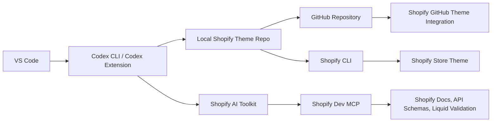
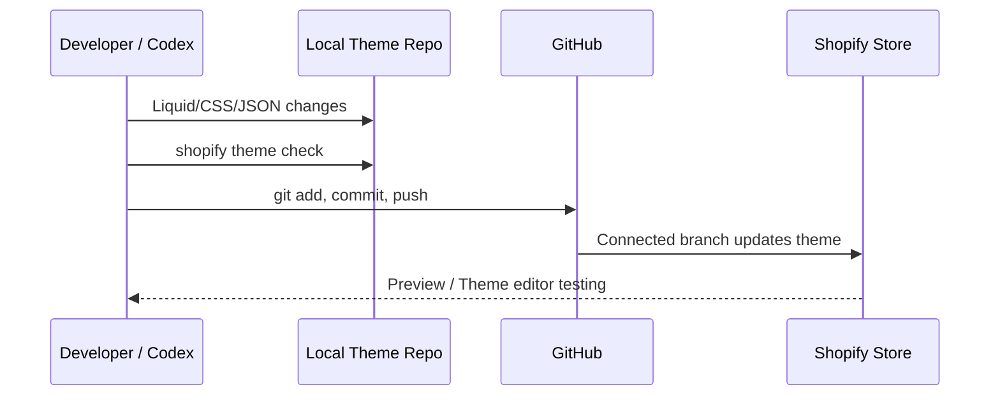
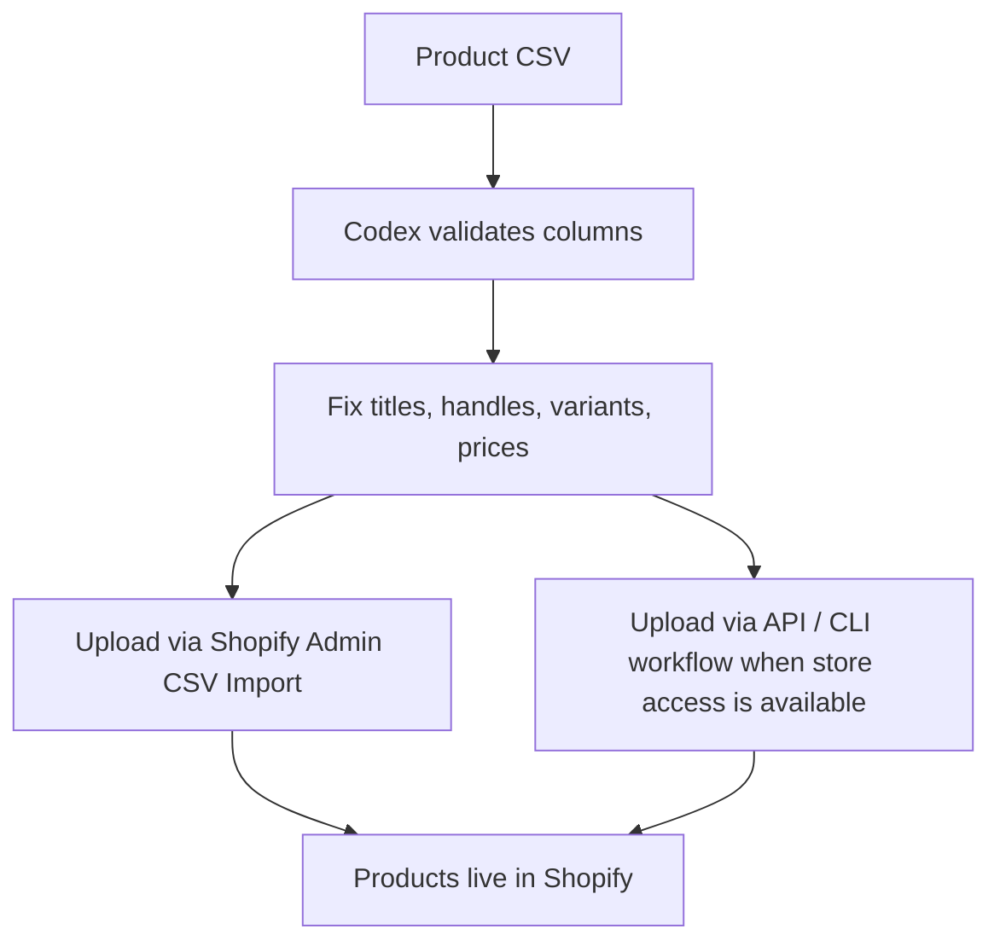
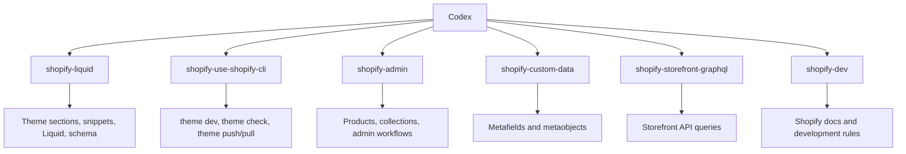

# VS Code, Codex, Shopify CLI, Shopify AI Toolkit, and GitHub Setup Guide

This document defines the developer workflow for setting up Codex in VS Code, installing Shopify CLI through Codex, connecting Shopify AI Toolkit, connecting GitHub, deploying a Shopify theme, and understanding what Shopify changes can be made through prompts.

## Full Workflow Diagram



## 1. Prerequisites

The system should have these tools available:

```powershell
node --version
npm --version
git --version
code --version
```

Recommended:

- Node.js 18+ is required for Shopify AI Toolkit.
- The latest Shopify CLI can require a newer Node.js version. This system uses Node `20.19.4`, so the compatible Shopify CLI version `3.94.3` was used.
- A GitHub account and Shopify admin access are required.

## 2. Install Codex in VS Code

There are two common ways to use Codex in VS Code.

### Option A: VS Code Extension

1. Open VS Code.
2. Open the Extensions panel.
3. Search for the official OpenAI Codex / ChatGPT extension.
4. Install the extension.
5. Sign in with your OpenAI account.
6. Open the project folder:

```powershell
code C:\Users\admin\Desktop\Ai-theme-file
```

### Option B: Codex CLI

In the VS Code terminal:

```powershell
npm install -g @openai/codex
codex --version
codex
```

The project should be trusted. The current Codex config marks this project as trusted:

```toml
[projects.'c:\users\admin\desktop\ai-theme-file']
trust_level = "trusted"
```

## 3. Shopify CLI Install

Shopify CLI can be used for theme preview, theme checks, theme push/pull, and store commands.

Latest install command:

```powershell
npm install -g @shopify/cli@latest
shopify version
```

On this machine, the latest CLI required Node 22+, so the compatible CLI version was installed:

```powershell
npm install -g @shopify/cli@3.94.3
shopify version
```

Theme validation:

```powershell
shopify theme check
```

Local theme preview:

```powershell
shopify theme dev --store your-store.myshopify.com
```

Theme push:

```powershell
shopify theme push --store your-store.myshopify.com
```

Theme pull:

```powershell
shopify theme pull --store your-store.myshopify.com
```

## 4. Shopify AI Toolkit Install

Shopify AI Toolkit connects Codex to Shopify platform documentation, API schemas, Liquid validation, and Shopify-specific instructions. This helps Codex work with official Shopify context instead of guessing Shopify structure.

### MCP Server Config

Codex config file:

```powershell
notepad $env:USERPROFILE\.codex\config.toml
```

Add this MCP server entry:

```toml
[mcp_servers.shopify-dev-mcp]
command = "npx"
args = ["-y", "@shopify/dev-mcp@latest"]
```

Config verify:

```powershell
Get-Content $env:USERPROFILE\.codex\config.toml
```

### Shopify Toolkit Skills Install

Install Shopify AI Toolkit skills for Codex in the project:

```powershell
npx skills add Shopify/shopify-ai-toolkit --agent codex --skill "*" -y --copy
```

Verify:

```powershell
npx skills list --agent codex
```

The current project has 20 Shopify skills installed:

| Skill | Purpose |
| --- | --- |
| `shopify-admin` | Shopify Admin API, store admin operations, product/order/customer related guidance |
| `shopify-app-store-review` | Shopify app review rules and app submission guidance |
| `shopify-custom-data` | Metafields, metaobjects, custom data setup |
| `shopify-customer` | Customer account and customer data workflows |
| `shopify-dev` | General Shopify development guidance |
| `shopify-functions` | Shopify Functions development |
| `shopify-hydrogen` | Hydrogen storefront development |
| `shopify-liquid` | Liquid theme code, sections, snippets, schema, theme rules |
| `shopify-onboarding-dev` | Developer onboarding workflow |
| `shopify-onboarding-merchant` | Merchant onboarding workflow |
| `shopify-partner` | Shopify Partner workflow |
| `shopify-payments-apps` | Payments app guidance |
| `shopify-polaris-admin-extensions` | Polaris admin extension UI |
| `shopify-polaris-app-home` | Polaris app home screen UI |
| `shopify-polaris-checkout-extensions` | Checkout UI extension guidance |
| `shopify-polaris-customer-account-extensions` | Customer account extension UI |
| `shopify-pos-ui` | Shopify POS UI extensions |
| `shopify-storefront-graphql` | Storefront GraphQL API guidance |
| `shopify-use-shopify-cli` | Shopify CLI commands and workflows |
| `ucp` | Universal configuration/integration support used by toolkit |

Important: Codex or VS Code may need to be restarted before MCP servers and skills are loaded.

## 5. GitHub Connect

To connect the theme repository to GitHub:

```powershell
git status
git remote -v
git add .
git commit -m "Your commit message"
git push origin main
```

Current repo remote:

```powershell
git remote -v
```

Expected:

```text
origin https://github.com/sushilyadav001/AI-shopify-theme.git
```

## 6. Connect GitHub to the Shopify Store

In Shopify admin:

1. Open Shopify Admin.
2. Go to Online Store > Themes.
3. Select Add theme > Connect from GitHub.
4. Authorize the GitHub account.
5. Select the repository.
6. Select the branch, usually `main`.
7. Connect the branch.

Shopify GitHub integration behavior:

- When the GitHub branch is updated, the connected Shopify theme can update.
- The GitHub branch becomes the source of truth for theme code.
- Testing on a development or staging theme before connecting a production theme is best practice.

## 7. Shopify Theme Development Flow



Recommended flow:

```powershell
git status
shopify theme check
git add sections assets templates config snippets layout
git commit -m "Update Shopify theme"
git push origin main
```

For direct CLI deployment:

```powershell
shopify theme push --store your-store.myshopify.com
```

## 8. Shopify Changes Available Through Prompts

### Theme Changes

Codex can make these changes from prompts:

- Header design update
- Footer section create/update
- Homepage sections create
- Product detail page design update
- Collection listing page update
- Banner, category, best seller, campaign sections add
- Theme settings schema update
- CSS responsive fixes
- Liquid bugs fix
- Shopify section schema blocks/settings add
- Add or update images in theme assets
- Theme documentation create

Example prompt:

```text
Create a new Shopify section after the main banner with desktop and mobile image picker, heading, CTA button, and schema settings.
```

### Product Changes

When Shopify Admin API or store access is available, prompts can be used for:

- Product create
- Product title/description update
- Price update
- Compare-at price update
- SKU update
- Inventory quantity update
- Product images/media upload
- Variants create/update
- Size/color options add
- Tags/vendor/product type update
- Collections assign
- Product publish/unpublish
- Metafields update

Example prompt:

```text
Create product "Plus Size Black Jogger" with price 1499, compare-at price 1999, sizes 2XL to 6XL, vendor Marca Bold, tags plus-size,jogger,black, and publish it to Online Store.
```

### CSV Product Upload

CSV files can be used for bulk product uploads. Basic Shopify product CSV columns:

```csv
Handle,Title,Body (HTML),Vendor,Product Category,Type,Tags,Published,Option1 Name,Option1 Value,Variant SKU,Variant Price,Variant Inventory Qty,Image Src
```

Workflow:



Prompt example:

```text
Review this product CSV, fix Shopify column names, create handles, validate variants, and prepare it for Shopify product import.
```

## 9. Agent / Skill Responsibility Diagram



## 10. Common Commands Cheat Sheet

### Codex

```powershell
npm install -g @openai/codex
codex --version
codex
```

Upgrade Codex:

```powershell
codex --upgrade
```

Open project in VS Code:

```powershell
code C:\Users\admin\Desktop\Ai-theme-file
```

### Shopify CLI

```powershell
npm install -g @shopify/cli@latest
shopify version
shopify theme check
shopify theme dev --store your-store.myshopify.com
shopify theme push --store your-store.myshopify.com
shopify theme pull --store your-store.myshopify.com
```

Compatible CLI install for Node 20:

```powershell
npm install -g @shopify/cli@3.94.3
shopify version
```

Login/logout:

```powershell
shopify auth login
shopify auth logout
```

List theme commands:

```powershell
shopify theme --help
shopify theme dev --help
shopify theme push --help
shopify theme pull --help
shopify theme check --help
```

Run local development server:

```powershell
shopify theme dev --store your-store.myshopify.com
```

Push as unpublished theme:

```powershell
shopify theme push --store your-store.myshopify.com --unpublished
```

Push to specific theme ID:

```powershell
shopify theme push --store your-store.myshopify.com --theme THEME_ID
```

Pull from specific theme ID:

```powershell
shopify theme pull --store your-store.myshopify.com --theme THEME_ID
```

Open theme in browser/admin:

```powershell
shopify theme open --store your-store.myshopify.com
```

List store themes:

```powershell
shopify theme list --store your-store.myshopify.com
```

### Shopify AI Toolkit

```powershell
npx skills add Shopify/shopify-ai-toolkit --agent codex --skill "*" -y --copy
npx skills list --agent codex
```

Remove installed skills if wrong agent folders were created:

```powershell
npx skills remove --all -y
```

Check Shopify Dev MCP package version:

```powershell
npm view @shopify/dev-mcp version
```

Verify Codex MCP config:

```powershell
Get-Content $env:USERPROFILE\.codex\config.toml
```

### GitHub

```powershell
git status
git add .
git commit -m "Update Shopify theme"
git push origin main
```

Check branch and remote:

```powershell
git branch
git remote -v
git status --short --branch
```

Create a new branch:

```powershell
git checkout -b feature/shopify-theme-update
```

Stage selected theme files only:

```powershell
git add assets sections snippets templates config layout locales
```

See changed files:

```powershell
git diff --name-only
git diff --stat
```

See exact changes:

```powershell
git diff
```

Commit selected work:

```powershell
git commit -m "Add Shopify Codex setup guide"
```

Push current branch:

```powershell
git push origin main
```

Pull latest changes:

```powershell
git pull origin main
```

View recent commits:

```powershell
git log --oneline -5
```

## 11. Full Command Reference

### System Check Commands

```powershell
node --version
npm --version
git --version
code --version
shopify version
codex --version
```

### Project Navigation Commands

```powershell
cd C:\Users\admin\Desktop\Ai-theme-file
Get-ChildItem -Force
Get-ChildItem sections
Get-ChildItem assets
Get-ChildItem templates
```

### File Read Commands

```powershell
Get-Content layout\theme.liquid
Get-Content config\settings_schema.json
Get-Content config\settings_data.json
Get-Content MARCABOLD_IMPLEMENTATION.md
Get-Content SHOPIFY_CODEX_SETUP_GUIDE.md
```

### Search Commands

```powershell
rg "marcabold"
rg "schema" sections
rg "theme" layout
rg --files
rg --files assets
rg --files sections
```

### Shopify Theme Validation Commands

```powershell
shopify theme check
shopify theme check --fail-level error
shopify theme check sections\marcabold-secondary-banner.liquid
```

### Shopify Theme Deploy Commands

```powershell
shopify theme dev --store your-store.myshopify.com
shopify theme list --store your-store.myshopify.com
shopify theme push --store your-store.myshopify.com
shopify theme push --store your-store.myshopify.com --unpublished
shopify theme push --store your-store.myshopify.com --theme THEME_ID
shopify theme pull --store your-store.myshopify.com
shopify theme pull --store your-store.myshopify.com --theme THEME_ID
shopify theme open --store your-store.myshopify.com
```

### Shopify Product CSV Commands

CSV import is usually handled manually in Shopify Admin. Codex can review and fix the CSV:

```powershell
Get-Content products.csv
Import-Csv products.csv
```

If the CSV path is different:

```powershell
Get-Content C:\path\to\products.csv
Import-Csv C:\path\to\products.csv
```

After the CSV is prepared, use Shopify Admin:

```text
Shopify Admin > Products > Import > Add file > Upload and continue
```

### GitHub Deployment Commands

```powershell
git status --short --branch
git diff --stat
git add SHOPIFY_CODEX_SETUP_GUIDE.md
git add sections\marcabold-secondary-banner.liquid
git add .agents skills-lock.json
git commit -m "Add Shopify Codex setup documentation"
git push origin main
```

Important: Commit `.agents` and `skills-lock.json` only when the team wants to keep Shopify AI Toolkit skills in the repository.

### Safe Review Commands Before Push

```powershell
git status --short --branch
git diff --name-only --cached
git diff --cached --stat
git log --oneline -3
shopify theme check
```

### Node/NPM Troubleshooting Commands

```powershell
npm cache verify
npm list -g --depth=0
npm view @shopify/cli version
npm view @shopify/dev-mcp version
npm view @openai/codex version
```

### Shopify AI Toolkit Troubleshooting Commands

```powershell
npx skills --help
npx skills list --agent codex
npx skills add Shopify/shopify-ai-toolkit --agent codex --skill "*" -y --copy
npx skills remove --all -y
Get-Content $env:USERPROFILE\.codex\config.toml
```

### Restart Checklist Commands

After Codex/VS Code restart:

```powershell
cd C:\Users\admin\Desktop\Ai-theme-file
npx skills list --agent codex
shopify version
shopify theme check
git status --short --branch
```

## 12. Safety Rules

- Test on a preview or staging theme before pushing directly to production.
- Run `shopify theme check`.
- Check `git status` before pushing to GitHub.
- Keep a CSV backup before uploading products.
- Test bulk product changes first on a development store or draft products.
- Do not commit store admin access tokens to a public repository.
- Theme assets and Shopify Content > Files are separate. The theme repo `assets/` folder does not directly upload Shopify Content Files.

## 13. Troubleshooting

### Error After Installing Latest Shopify CLI

If the latest CLI fails because of the Node.js version:

```powershell
node --version
npm install -g @shopify/cli@3.94.3
shopify version
```

Or install Node 22+ and then run:

```powershell
npm install -g @shopify/cli@latest
```

### Shopify AI Toolkit Skills Are Not Showing

```powershell
npx skills list --agent codex
```

Then restart VS Code or Codex.

### Shopify MCP Config Is Not Loading

Config verify:

```powershell
Get-Content $env:USERPROFILE\.codex\config.toml
```

Expected:

```toml
[mcp_servers.shopify-dev-mcp]
command = "npx"
args = ["-y", "@shopify/dev-mcp@latest"]
```

## 14. Official References

- OpenAI Codex CLI Help: https://help.openai.com/en/articles/11096431
- OpenAI Codex Getting Started: https://help.openai.com/en/articles/11369540-getting-started-with-codex
- Shopify CLI Docs: https://shopify.dev/docs/api/shopify-cli
- Shopify AI Toolkit Docs: https://shopify.dev/docs/apps/build/devmcp
- Shopify GitHub Theme Integration: https://shopify.dev/storefronts/themes/tools/github
