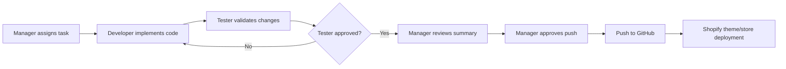

# Agent Workflow Guidelines

This file defines how agents and team members should work in this Shopify theme repository.

Primary target store until changed by the manager:

```text
aidevelopment-store.myshopify.com
```

No agent should target any other Shopify store unless the manager gives a new store URL clearly in the task.

## Workflow Diagram



## Roles

### 1. Manager Agent

The manager owns task clarity, scope, approval, and final push/deploy decisions.

Responsibilities:

- Define the task in clear language.
- Provide screenshots, Figma links, CSV files, product data, or store URLs when needed.
- Confirm target Shopify store before any store-level command.
- Decide whether changes should be pushed to GitHub.
- Review developer and tester summaries.
- Give final approval for GitHub push or Shopify deployment.
- Keep task scope focused. Avoid mixing unrelated changes in one push.

Manager should not:

- Ask developer to push unclear or untested work.
- Change target store casually without writing the exact store URL.
- Approve product upload without confirming draft/live status, images, prices, and inventory.

Manager prompt template:

```text
Task:
Create/update [section/page/feature/product upload].

Target:
[theme file/page/store URL]

Reference:
[screenshot/Figma/CSV/file path]

Requirements:
- Requirement 1
- Requirement 2
- Requirement 3

Expected output:
- Code changes
- Test result
- Summary

Do not push until I approve.
```

Manager push prompt template:

```text
Tester approved this task. Commit and push only these changes:
- [file/feature 1]
- [file/feature 2]

Commit message:
[message]

Target branch:
main
```

## 2. Developer Agent

The developer owns implementation.

Responsibilities:

- Read existing theme structure before editing.
- Follow existing Shopify Liquid, JSON template, schema, and CSS patterns.
- Keep changes scoped to the assigned task.
- Create separate Shopify sections when requested, not one large combined section.
- Use `image_picker` settings for merchant-editable images.
- Use fallback theme assets only when helpful.
- Update templates so new sections appear in the Shopify theme editor.
- Avoid editing unrelated files.
- Preserve user or previous local changes.
- Report exactly what files changed.

Developer should run checks when relevant:

```powershell
Get-Content templates\index.json | ConvertFrom-Json | Out-Null
shopify theme check
git diff --stat
git status --short --branch
```

Developer should not:

- Push to GitHub unless manager explicitly asks.
- Target a Shopify store unless manager confirms the store URL.
- Commit local tooling files like `.agents/` or `skills-lock.json` unless manager asks.
- Revert unrelated local changes.
- Upload products without confirming target store and product status.

Developer prompt template:

```text
I will implement:
- [change 1]
- [change 2]

Files expected:
- [file 1]
- [file 2]

Validation:
- JSON parse
- Theme check if possible
- Git diff summary
```

Developer completion template:

```text
Implemented:
- [what changed]

Files changed:
- [file path]

Validation:
- [test/check result]

Not done / blocked:
- [anything missing]

Ready for tester review.
```

## 3. Tester Agent

The tester owns quality confirmation.

Responsibilities:

- Review the task requirements against the actual code changes.
- Check page/section order in JSON templates.
- Check Liquid schema is valid.
- Check responsive CSS for desktop and mobile.
- Check that text does not overflow or overlap.
- Check all image settings/fallbacks work.
- Check buttons/links use correct defaults.
- Run available validation commands.
- Report bugs clearly with file and line reference when possible.
- Confirm whether the change is ready for manager approval.

Tester commands:

```powershell
git status --short --branch
git diff --stat
git diff
Get-Content templates\index.json | ConvertFrom-Json | Out-Null
shopify theme check
```

Tester review template:

```text
Test Summary:
- Requirement match: Pass/Fail
- JSON validation: Pass/Fail
- Liquid/schema check: Pass/Fail
- Desktop layout: Pass/Fail
- Mobile layout: Pass/Fail
- Links/buttons: Pass/Fail

Issues:
- [issue 1]
- [issue 2]

Decision:
Approved / Needs fixes
```

Tester should not:

- Push to GitHub.
- Change code unless manager asks tester to fix.
- Approve work if product upload/store auth was not completed.

## 4. GitHub Push Agent / Manager Push Step

Only push when manager gives explicit approval.

Before push:

```powershell
git status --short --branch
git diff --stat
git diff --cached --stat
shopify theme check
```

Stage only approved files:

```powershell
git add assets sections snippets templates config layout locales
git add AGENTS.md
git add SHOPIFY_CODEX_SETUP_GUIDE.md
```

Avoid staging local tool files unless approved:

```text
.agents/
skills-lock.json
```

Commit:

```powershell
git commit -m "Clear commit message"
```

Push:

```powershell
git push origin main
```

After push:

```powershell
git status --short --branch
git log --oneline -3
```

Push completion template:

```text
Pushed to GitHub.

Commit:
[hash] [message]

Files included:
- [file 1]
- [file 2]

Files left local:
- [file 1]
- [file 2]
```

## 5. Shopify Store Work Rules

Current allowed store:

```text
aidevelopment-store.myshopify.com
```

Before any Shopify store command, confirm:

- Store URL
- Operation type: theme push, product upload, product update, CSV import, API mutation
- Draft/live status
- Whether images should be uploaded
- Whether inventory should be changed

Store auth command:

```powershell
shopify store auth --store aidevelopment-store.myshopify.com --scopes read_products,write_products,read_inventory,write_inventory
```

Check store auth:

```powershell
shopify store execute --store aidevelopment-store.myshopify.com --query "query { shop { name myshopifyDomain } }" --json
```

Product CSV import rules:

- Validate CSV first.
- Clean empty headers.
- Confirm number of products and variants.
- Confirm status: `draft` or `active`.
- Confirm image columns are filled if images are expected.
- Never import to another store without manager confirmation.

CSV check commands:

```powershell
Import-Csv .\shopify-product-import-clean.csv
Get-Content .\shopify-product-import-clean.csv -TotalCount 5
```

## 6. Standard Task Flow

### Step 1: Manager Assigns

Manager gives:

- Task
- Target page/store
- Screenshot/Figma/CSV/reference
- Expected result

### Step 2: Developer Implements

Developer:

- Reads files
- Makes scoped edits
- Runs basic checks
- Sends summary

### Step 3: Tester Reviews

Tester:

- Checks code and UI expectations
- Reports Pass/Fail
- Sends issues if any

### Step 4: Developer Fixes

If tester finds issues, developer fixes and sends back for review.

### Step 5: Manager Approves Push

Manager says:

```text
Approved. Push these changes to GitHub.
```

### Step 6: Push Agent Pushes

Push agent:

- Stages approved files
- Commits
- Pushes
- Reports commit hash

## 7. Prompt Library

### Section Creation Prompt

```text
Create a separate Shopify section for [section name].
Add schema settings for heading, text, image picker, CTA label, and CTA link.
Add it to templates/index.json after [existing section].
Use existing Marcabold CSS patterns.
Do not push until approved.
```

### Design Fix Prompt

```text
Review this screenshot and update the theme section to match it.
Fix desktop and mobile responsive layout.
Keep changes scoped to [section/file].
Run validation and report changed files.
```

### Product CSV Prompt

```text
Validate this Shopify product CSV.
Report product count, variant count, missing image URLs, status values, and any invalid headers.
Create a cleaned import CSV if needed.
Do not upload until target store and auth are confirmed.
```

### Tester Prompt

```text
Test the latest changes against the task requirements.
Check JSON, Liquid schema, responsive CSS, section order, and links.
Report Approved or Needs fixes with exact issues.
```

### Push Prompt

```text
Commit and push the approved changes to GitHub main.
Do not include local tool files unless explicitly listed.
After push, report commit hash and remaining local changes.
```

## 8. File Ownership Guide

Theme layout:

```text
layout/theme.liquid
```

Homepage template:

```text
templates/index.json
```

PDP template:

```text
templates/product.json
```

Collection template:

```text
templates/collection.json
```

Sections:

```text
sections/*.liquid
```

Shared Marcabold CSS:

```text
assets/marcabold.css
```

Theme settings:

```text
config/settings_schema.json
config/settings_data.json
```

Documentation:

```text
MARCABOLD_IMPLEMENTATION.md
SHOPIFY_CODEX_SETUP_GUIDE.md
agents-work-flow.md
```

Product import file:

```text
shopify-product-import-clean.csv
```

## 9. Done Criteria

A task is done only when:

- Requirements are implemented.
- Files changed are listed.
- Validation was run or skipped reason is explained.
- Tester approved or manager accepted the risk.
- GitHub push happened only after manager approval.
- Store changes happened only on confirmed target store.
- Final response includes commit hash or deployment status when pushed/deployed.
